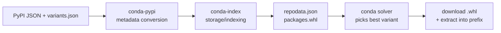

# Plan: PEP 825 Variant Wheel Support  - conda-pypi & conda-index

## Summary

PEP 825 introduces variant wheels: platform-specific wheels annotated with hardware requirements (CUDA version, GPU arch, SIMD features). This plan extends conda-pypi and conda-index to produce conda repodata from variant wheel metadata, so that `conda install torch` automatically selects the right CUDA variant for the user's GPU.

The approach: translate variant properties into conda virtual package dependencies (`__cuda >=12.9`) plus concrete runtime deps (`cuda-toolkit >=12.9`) on repodata entries pointing at `.whl` files. The solver handles selection. Channel priority controls whether variant wheels or conda-forge packages win. Wheels are installed directly via the existing extractor hook.

This does not require changes to conda core. It builds on conda-pypi's existing pure-Python wheel support (repodata v3 `packages.whl` entries) and conda's existing virtual package infrastructure.

---

## Context

### Problem

Python variant wheels (PEP 817 umbrella / PEP 825 package format  - both Draft, PEP 825 has Paul Moore as delegate) express hardware/software capability requirements (CUDA version, GPU arch, SIMD features) via `namespace::feature::value` properties. Conda has virtual packages (`__cuda`, `__archspec`, `__glibc`) and conda-forge ships multiple variants. But there's no connection between variant wheel metadata and conda's ecosystem. uv (Astral) has a working prototype on the `charlie/wheel-variant` branch ([PR #12203](https://github.com/astral-sh/uv/pull/12203)); pip has no active work. The PEP design was inspired by conda/Spack's existing variant systems.

### Current architecture

Confirmed from latest `conda-pypi-test` main branch:

- `conda-pypi-test/generate.py` uses **conda-pypi's `store_pypi_metadata()`** + **conda-index's `BaseCondaIndexCache`** to produce repodata
- `conda_pypi/pypi_metadata.py` (`pypi_to_repodata()`) converts PyPI JSON  -> repodata entries
- `conda_pypi/index.py` (`store_pypi_metadata()`) stores entries via conda-index cache
- conda-index's `ChannelIndex` builds the final `repodata.json` with `packages.whl` entries
- conda then downloads `.whl` files directly and installs via `extract_whl_as_conda_pkg` hook



### Goal

Extend this chain to handle variant wheels. When a package has a `-variants.json` (served on PEP 503 simple pages alongside wheels), produce multiple repodata entries (one per compatible variant), each with virtual package deps AND concrete runtime deps so the solver ensures the wheel actually works in the environment.

> [!IMPORTANT]
> Variant wheel repodata entries need BOTH:
> - **Virtual package deps** (e.g., `__cuda >=12.9`) - gates eligibility based on hardware
> - **Concrete runtime deps** (e.g., `cuda-toolkit >=12.9`) - ensures conda-managed runtime libraries are present so the wheel works
>
> This is the same pattern conda-forge uses: `__cuda` checks hardware, `cuda-toolkit` provides runtime. Modeled after CEP-12/21/34 `run_exports` mechanism.

Design decisions:

- variantlib is a required dependency of conda-pypi
- All variant code in `conda_pypi/variants/` subpackage
- New conda virtual packages registered for uncovered dimensions
- Variant wheel entries get both virtual package deps AND concrete runtime deps
- Channel priority (standard conda) controls wheel-vs-conda-package preference
- `.whl` files installed directly via existing extractor hook
- ABI verification via post-install shared library resolution check
- Providers are conda packages installed in the environment (not temp venvs)

---

## Phase 1: Variant Property  -> Conda Dependency Mapping

New file: `conda_pypi/variants/mapping.py`

Two mapping layers (analogous to `name_mapping.py` for PyPI ->conda names):

### 1a: Virtual package mapping (hardware eligibility)

| Variant Property | Virtual Package Dep |
| --- | --- |
| `nvidia :: cuda_version_lower_bound :: 12.9` | `__cuda >=12.9` |
| `nvidia :: cuda_version_upper_bound :: 13` | `__cuda <13` |
| `nvidia :: sm_arch :: 90_real` | `__cuda_arch >=9.0` (convert: strip `_real`/`_virtual` suffix, insert dot  -> `9.0`) [1] |
| `simd_x86_64 :: {feature} :: {value}` | `__simd_x86_64 =={value}` |
| `aarch64 :: {feature} :: {value}` | `__simd_aarch64 =={value}` |
| `{ns} :: {feature} :: {value}` (fallback) | `__variant_{ns}_{feature} =={value}` |

[1] **CUDA arch ordering is not linear**: CUDA 12.8 introduced architecture families, and `sm_53` is compatible with `sm_50`. Simple `>=` comparison may not be sufficient. The `__cuda_arch` CEP (conda/ceps PR #157) is working through this complexity. Our mapping must align with whatever ordering the CEP defines. For now, assume `__cuda_arch` version uses `{major}.{minor}` format with standard version comparison, and track the CEP for changes.

### 1b: Runtime package mapping (ABI compatibility)

Data format (following CEP-34 `depends`/`constrains` pattern, using CEP-29 MatchSpec syntax):

```yaml
# conda_pypi/variants/runtime_mapping.yaml
version: 1
mappings:
  nvidia:
    cuda_version_lower_bound:
      depends_template: "cuda-toolkit >={value}"
    cuda_version_upper_bound:
      depends_template: "cuda-toolkit <{value}"
    sm_arch:
      # Hardware-only property, no runtime package needed
      depends_template: null
  simd_x86_64:
    # CPU features, no runtime package needed
    depends_template: null
  aarch64:
    depends_template: null
```

Using YAML (not JSON) for readability and comments. The `depends_template` uses `{value}` as a placeholder for the variant property value after any format conversion. `null` means no runtime dep needed (hardware-only property).

Functions:

```python
def variant_properties_to_virtual_deps(properties: list[VariantProperty]) -> list[str]:
    """Virtual package deps (hardware eligibility gate)."""

def variant_properties_to_runtime_deps(properties: list[VariantProperty]) -> list[str]:
    """Concrete conda package deps (runtime library requirements)."""

def variant_properties_to_all_deps(properties: list[VariantProperty]) -> list[str]:
    """Combined: virtual + runtime deps for a complete repodata entry."""
```

---

## Phase 2: New Conda Virtual Packages

Existing (do NOT duplicate):

- `__cuda`  - conda core (driver version, CEP-30)
- `__cuda_arch`  - `conda-incubator/nvidia-virtual-packages` plugin (min SM compute capability as `{major}.{minor}`)
- `__archspec`  - conda core (CPU microarchitecture name)
- `__glibc` / `__osx` / `__linux` / `__win`  - conda core (CEP-30)

Modified file: `conda_pypi/plugin.py`  - add `conda_virtual_packages()` hookimpl

New file: `conda_pypi/variants/virtual_packages.py`  - detection logic

Register virtual packages for dimensions NOT already covered:

- `__simd_x86_64`  - x86 SIMD feature level (provider-variant-x86-64)
- `__simd_aarch64`  - ARM SIMD features (provider-variant-aarch64)

Detection: variantlib's `EntryPointPluginLoader`  -> `get_supported_configs()`. Cached. Override via `CONDA_OVERRIDE_SIMD_X86_64` / `CONDA_OVERRIDE_SIMD_AARCH64` env vars.

```python
# plugin.py
from conda_pypi.variants.virtual_packages import get_variant_virtual_packages

@hookimpl
def conda_virtual_packages():
    yield from get_variant_virtual_packages()
```

---

## Phase 3: Variant-Aware Repodata Entry Generation

New file: `conda_pypi/variants/repodata.py`

Currently `pypi_to_repodata()` in `pypi_metadata.py` only produces entries for `py3-none-any` wheels. The variant equivalent lives in the variants subpackage:

New function: `pypi_variant_to_repodata()`

```python
def pypi_variant_to_repodata(
    pypi_data: dict[str, Any],
    variants_json: VariantsJson,
    pypi_to_conda_name_mapping: dict | None = None,
) -> list[tuple[str, dict[str, Any]]]:
    """Convert PyPI data + variant metadata to multiple repodata entries.
    
    Returns list of (repodata_key, entry_dict) pairs  - one per compatible variant
    plus a null-variant/non-variant fallback.
    
    Each entry includes:
    - url: direct wheel URL on the registry
    - fn: wheel filename (with variant label)
    - build: includes variant label for uniqueness
    - depends: base deps + virtual package deps + runtime package deps
    - subdir: derived from wheel platform tag
    - build_number: ordered by variant priority (most specific = highest)
    """
```

New file: `conda_pypi/variants/platform.py`  - wheel platform tag  -> conda subdir mapping:

```python
PLATFORM_TAG_TO_SUBDIR = {
    "manylinux": {"x86_64": "linux-64", "aarch64": "linux-aarch64", "ppc64le": "linux-ppc64le"},
    "linux": {"x86_64": "linux-64", "aarch64": "linux-aarch64"},
    "macosx": {"x86_64": "osx-64", "arm64": "osx-arm64"},
    "win": {"amd64": "win-64", "arm64": "win-arm64"},
}
```

Filename parsing: The variant label is the last dash-separated field in the wheel filename (e.g., `torch-2.4.0-cp312-cp312-manylinux_2_28_x86_64-cu129abc1.whl`). This is ambiguous with platform tags when parsing. The `pypa/packaging` library has [issue #1148](https://github.com/pypa/packaging/issues/1148) tracking how to update `parse_wheel_filename()` for this. Our parser should use the `variants.json` to know which labels are valid variants for a given package/version rather than guessing from the filename alone.

---

## Phase 4: Variant Index Discovery

New file: `conda_pypi/variants/discovery.py`

The authoritative registry list lives in `wheelnext/variants-index` repo's `index.toml`. In uv's implementation, `variants.json` files are served on the **same PEP 503 simple page** alongside wheels (as regular file links). The filename format is `{name}-{version}-variants.json`.

| Registry | Packages | URL |
| --- | --- | --- |
| quansight | numpy, scipy, scikit-learn, BLAS/SIMD providers | `https://pypi.anaconda.org/mgorny/simple/` |
| nvidia | cublas, cudnn, nccl, cuda-runtime, etc. | `https://variants-index.wheelnext.dev/` |
| pytorch | torch, torchvision | `https://download.pytorch.org/whl/variant/` |
| triton | triton, triton-rocm, triton-xpu | `https://download.pytorch.org/whl/variant/` |
| xgboost | xgboost | `https://wheels-variant.xgboost-ci.com/` |
| cupy | cupy | `https://variants-index.wheelnext.dev/` |
| transformer-engine | transformer-engine | `https://variants-index.wheelnext.dev/` |
| huawei-ascend | vllm-ascend | `https://mirrors.huaweicloud.com/ascend/repos/pypi/variant/` |
| nvidia-provider | nvidia-variant-provider | `https://wheelnext.github.io/nvidia-variant-provider/` |
| intel-provider | intel-variant-provider | `https://wheelnext.github.io/intel-variant-provider/` |
| amd-provider | amd-variant-provider | `https://wheelnext.github.io/amd-variant-provider/` |

```python
async def fetch_variants_json(
    name: str, version: str, client: httpx.AsyncClient, index_urls: list[str] | None = None
) -> VariantsJson | None:
    """Fetch {name}-{version}-variants.json from variant registries.
    
    Registry list can be loaded from variants-index/index.toml or configured manually.
    Each registry is a PEP 503-compatible simple repository where variants.json
    is listed alongside wheel files on the package's simple page.
    Returns None if package has no variants in any configured registry.
    """
```

This is called during repodata generation (in `conda-pypi-test/generate.py` or `conda pypi install` flows) to discover whether a package has variant wheels available.

---

## Phase 5: Variant-Aware Storage in conda-index

Modified file: `conda_pypi/index.py`

New function alongside existing `store_pypi_metadata()`, delegating to the variants subpackage:

```python
from conda_pypi.variants.repodata import pypi_variant_to_repodata

def store_pypi_variant_metadata(
    cache: BaseCondaIndexCache,
    pypi_json: dict[str, Any],
    variants_json: VariantsJson,
) -> None:
    """Store multiple repodata entries for a package's variant wheels.
    
    Calls variants.repodata.pypi_variant_to_repodata() to produce entries,
    then stores each in the conda-index cache under the appropriate subdir.
    """
```

The existing `store_pypi_metadata()` continues to handle pure-Python wheels. The new function handles variant (platform-specific) wheels.

Channel structure change: Currently only `noarch/` exists. Variant wheels need platform subdirs (e.g., `linux-64/`, `osx-arm64/`). The `ChannelIndex` already supports multiple subdirs.

---

## Phase 6: conda-pypi-test Generator Update

Modified file: `conda-pypi-test/generate.py`

Extend the async generation loop:

1. After fetching PyPI JSON for each package, also check its simple page for `-variants.json`
2. If variants found, call `store_pypi_variant_metadata()` for each subdir
3. Ensure `ChannelIndex` is configured to index all subdirs (not just noarch)
4. Packages with only pure-Python wheels continue to use `store_pypi_metadata()` (unchanged)

---

## Phase 7: Package Extractor Update

Modified file: `conda_pypi/package_extractors/whl.py`

For variant wheels (platform-specific):

- Check for `.dist-info/variant.json`  -> store in `info/variant.json`
- Set build string in `info/index.json` to include variant label
- Do NOT set `noarch` in `link.json` for platform-specific wheels
- Handle `platlib` scheme correctly (variant wheels use platlib, not purelib)

---

## Phase 8: Provider Discovery and Installation

New file: `conda_pypi/variants/providers.py`

Variant providers (e.g., `nvidia-variant-provider`) need to be available to detect system capabilities. Unlike uv (which uses temp venvs), conda-pypi should use conda-native mechanisms:

Approach: Provider packages are conda packages installed in the user's environment. If a required provider isn't installed, conda-pypi prompts the user to install it (or adds it as a dependency).

1. Check if the provider is importable in the current conda environment
2. If not installed, warn the user and suggest `conda install nvidia-variant-provider`
3. If installed, call `get_supported_configs()` directly (in-process, no subprocess needed since we're in the same environment)
4. Cache the result for the session duration

For **repodata generation** (channel building in `conda-pypi-test/generate.py`): the build environment should have all necessary providers pre-installed. The `environment.yml` for the generator includes them as dependencies.

```python
def get_provider_configs(namespace: str) -> list[VariantFeatureConfig] | None:
    """Query an installed variant provider for its supported configurations.
    
    Returns None if the provider is not installed (logs a warning).
    Uses variantlib's EntryPointPluginLoader for discovery.
    Results cached per session.
    """

def check_missing_providers(variants_json: VariantsJson) -> list[str]:
    """Return list of provider packages that are required but not installed."""
```

Provider packages should be available as both conda packages (from conda-forge) and PyPI packages. The conda packages are preferred for consistency with the environment.

### Static vs install-time providers

The `variants.json` distinguishes two provider types:

- `"install-time": true` - must query the system at install time (e.g., nvidia-variant-provider detects GPU)
- `"install-time": false` - properties come from `static-properties` in the variants.json itself, no code execution needed

For static providers, no provider package needs to be installed. The repodata generator can read the properties directly from the variants.json.

### Conditional activation

Providers have `"enable-if"` fields using PEP 508 markers (e.g., `"enable-if": "platform_system == 'Linux' or platform_system == 'Windows'"`). The discovery phase must evaluate these markers against the target platform before attempting to load a provider.

---

## Phase 9: ABI Verification

New file: `conda_pypi/variants/abi_check.py`

Three-phase approach:

### 9a: Pre-install platform tag check (at repodata generation time)

Verify that wheel platform tags are compatible with the target platform. Parse `manylinux_2_28_x86_64`  -> requires `__glibc >=2.28`. Add this as a dependency to the repodata entry alongside the variant virtual package deps.

```python
def platform_tag_to_deps(wheel_filename: str) -> list[str]:
    """Extract glibc/musl requirements from wheel platform tags.
    
    manylinux_2_28_x86_64  -> ['__glibc >=2.28']
    musllinux_1_2_x86_64  -> ['__musl >=1.2']
    """
```

### 9b: Post-install shared library resolution check

A health check that scans installed variant wheel packages for unresolved `.so`/`.dylib` dependencies.

```python
def verify_shared_lib_deps(prefix: Path, package_paths: list[Path]) -> list[AbiIssue]:
    """Scan .so/.dylib files for unresolved shared library dependencies.
    
    Uses ldd (Linux) or otool (macOS) to check resolution within the
    conda prefix's lib directory.
    """
```

Integration: Can be used as:

- A post-install step in conda-pypi's `post_command/install.py`
- A `conda doctor` health check plugin
- An optional validation in `extract_whl_as_conda_pkg`

### 9c: CUDA/runtime version verification

At solve time, the runtime deps (`cuda-toolkit >=12.9`) already ensure the right version is present. Post-install, verify the actual `.so` version matches:

```python
def verify_cuda_runtime(prefix: Path) -> list[AbiIssue]:
    """Check that CUDA .so files resolve to the expected version."""
```

---

## Phase 10: conda-index Integration

Modified repo: `conda-index`

Similar to how conda-index gained repodata v3 wheel support, extend it to natively consume variant metadata during indexing.

New file: `conda_index/index/variants.py`

```python
def enrich_wheel_entries_with_variants(
    indexed_packages: IndexedPackages,
    variant_sources: list[VariantSource],
) -> IndexedPackages:
    """During indexing, discover and apply variant metadata to wheel entries.
    
    For each wheel in packages.whl that has a corresponding variants.json:
    - Parse variant properties
    - Generate multiple entries (one per variant)
    - Add virtual package + runtime deps to each entry
    """
```

Modified file: `conda_index/index/__init__.py`

In the `ChannelIndex.index()` pipeline:

- After extracting package metadata, check for `-variants.json` files in the channel directory
- If present, call `enrich_wheel_entries_with_variants()`
- The v3 output (`_extract_indexed_packages_v3()`) already handles `packages.whl`  - it just gets more entries

This follows the same extension pattern as `ChannelIndex`'s existing `package_extensions` parameter and `package_section_for_path()` method.

---

## Phase 11: Configuration

No new config format  - reuse existing systems:

- variantlib's `variants.toml` for priority configuration
- `CONDA_OVERRIDE_*` for virtual package overrides
- `.condarc` channel list controls preference (standard channel priority)
- `CONDA_PYPI_VARIANTS=true|false` (default: true)  - master switch
- Variant registry URLs configurable in `.condarc` or env var

---

## File Change Summary

### conda-pypi (`conda-pypi`)

All variant-related code lives in `conda_pypi/variants/` subpackage:

| File | Action | Purpose |
| --- | --- | --- |
| `conda_pypi/variants/__init__.py` | **New** | Package init, public API re-exports |
| `conda_pypi/variants/mapping.py` | **New** | Property  -> virtual + runtime dep mapping |
| `conda_pypi/variants/runtime_mapping.yaml` | **New** | Data: variant property  -> conda runtime package (CEP-34 pattern) |
| `conda_pypi/variants/virtual_packages.py` | **New** | New virtual package detection via providers |
| `conda_pypi/variants/discovery.py` | **New** | Fetch/parse `-variants.json` from registries |
| `conda_pypi/variants/repodata.py` | **New** | `pypi_variant_to_repodata()` entry generation |
| `conda_pypi/variants/platform.py` | **New** | Wheel platform tag  -> conda subdir mapping |
| `conda_pypi/variants/providers.py` | **New** | Provider discovery + missing provider detection |
| `conda_pypi/variants/abi_check.py` | **New** | Post-install shared library verification |
| `conda_pypi/plugin.py` | Modify | Add `conda_virtual_packages()` hook |
| `conda_pypi/index.py` | Modify | Add `store_pypi_variant_metadata()` |
| `conda_pypi/package_extractors/whl.py` | Modify | Handle variant.json, platform-specific link.json |
| `pyproject.toml` | Modify | Add `variantlib` as required dependency |

### conda-index (`conda-index`)

| File | Action | Purpose |
| --- | --- | --- |
| `conda_index/index/variants.py` | **New** | Variant metadata enrichment during indexing |
| `conda_index/index/__init__.py` | Modify | Integrate variant enrichment into pipeline |

### conda-pypi-test (`conda-pypi-test`)

| File | Action | Purpose |
| --- | --- | --- |
| `generate.py` | Modify | Fetch variants.json, call variant storage |

---

## Example Repodata Output

<details>
<summary>Example: torch==2.4.0 with CUDA variants</summary>

```json
{
  "info": { "subdir": "linux-64" },
  "packages": {},
  "packages.conda": {},
  "packages.whl": {
    "torch-2.4.0-cp312_linux_x86_64_cu129abc1_2": {
      "url": "https://download.pytorch.org/.../torch-2.4.0-cp312-cp312-manylinux_2_28_x86_64-cu129abc1.whl",
      "name": "torch",
      "version": "2.4.0",
      "build": "cp312_linux_x86_64_cu129abc1_2",
      "build_number": 2,
      "depends": [
        "python >=3.12",
        "__cuda >=12.9",
        "__cuda <13",
        "__cuda_arch >=9.0",
        "__glibc >=2.28",
        "cuda-toolkit >=12.9,<13"
      ],
      "fn": "torch-2.4.0-cp312-cp312-manylinux_2_28_x86_64-cu129abc1.whl",
      "sha256": "...",
      "size": 123456789,
      "subdir": "linux-64"
    },
    "torch-2.4.0-cp312_linux_x86_64_0": {
      "url": "https://download.pytorch.org/.../torch-2.4.0-cp312-cp312-manylinux_2_28_x86_64.whl",
      "name": "torch",
      "version": "2.4.0",
      "build": "cp312_linux_x86_64_0",
      "build_number": 0,
      "depends": [
        "python >=3.12",
        "__glibc >=2.28"
      ],
      "fn": "torch-2.4.0-cp312-cp312-manylinux_2_28_x86_64.whl",
      "sha256": "...",
      "size": 98765432,
      "subdir": "linux-64"
    }
  },
  "repodata_version": 1
}
```

Note: `__glibc >=2.28` is derived from the `manylinux_2_28` platform tag (Phase 9a).

</details>

---

## Verification Plan

1. **Unit tests** for `variants/mapping.py`: virtual + runtime dep generation from known properties
2. **Unit tests** for `variants/virtual_packages.py`: mock providers, verify CondaVirtualPackage yields
3. **Unit tests** for `variants/repodata.py`: mock PyPI data + variants.json  -> verify entries
4. **Unit tests** for `variants/platform.py`: wheel filename  -> subdir mapping
5. **Unit tests** for `variants/abi_check.py`: mock ldd output, verify issue detection
6. **Integration test**: Generate channel with variant torch entries via `store_pypi_variant_metadata()`. Verify repodata structure.
7. **Solver test**: Channel + conda-forge in condarc. Install torch. Verify solver picks variant matching `__cuda` AND pulls `cuda-toolkit`.
8. **Fallback test**: No CUDA  -> solver picks null-variant (build_number 0)
9. **ABI test**: Only `cuda-toolkit 11.8` available  -> solver rejects cu129 variant
10. **Provider test**: Provider not installed  -> warning issued, static properties still usable
11. **Extractor test**: variant.json preserved, link.json correct for platform wheel

### Real test targets (existing variant wheels)

These packages already have variant wheels published on registries and can be used for end-to-end testing:

- **PyTorch 2.8+** on `https://download.pytorch.org/whl/variant/` (CUDA variants)
- **numpy, scipy, scikit-learn** on `https://pypi.anaconda.org/mgorny/simple/` (BLAS/SIMD variants, from Quansight)
- **NVIDIA CUDA libs** (cublas, cudnn, nccl) on `https://variants-index.wheelnext.dev/`
- **xgboost** on `https://wheels-variant.xgboost-ci.com/`
- Demo/tutorial repo: [wheelnext/pep_817_wheel_variants](https://github.com/wheelnext/pep_817_wheel_variants)

---

## End-to-End Flow

```text
Setup:
  conda-pypi-test/generate.py produces repodata for "pypi-variants" channel
  (uses conda_pypi.index.store_pypi_variant_metadata  -> conda-index)
  
  User .condarc:
    channels:
      - https://pypi-variants.example.com
      - conda-forge
      - defaults

User: conda install torch

Solver state:
  Virtual packages: __cuda==12.9 (conda core), __cuda_arch==9.0 (nvidia-virtual-packages plugin)
  
  From pypi-variants (packages.whl):
    torch cu129 variant: depends [__cuda>=12.9, __cuda<13, __glibc>=2.28, cuda-toolkit>=12.9,<13]
    torch cu121 variant: depends [__cuda>=12.1, __cuda<12.9, __glibc>=2.28, cuda-toolkit>=12.1,<12.9]
    torch null variant:  depends [python>=3.12, __glibc>=2.28]
  
  From conda-forge (packages.conda):
    cuda-toolkit-12.9.0  (provides CUDA runtime)

Resolution:
  1. cu129 variant eligible (__cuda==12.9 satisfies >=12.9, __glibc satisfies >=2.28)
  2. cuda-toolkit>=12.9,<13  -> pulls cuda-toolkit 12.9 from conda-forge
  3. Downloads torch .whl from PyTorch registry
  4. extract_whl_as_conda_pkg installs into prefix
  5. Post-install: abi_check verifies .so deps resolve against prefix/lib
  6. Wheel works: cuda-toolkit runtime present in environment
```

---

## Compatibility with uv's Implementation

Key alignment points to ensure conda-pypi consumes the same metadata uv produces/consumes:

| Aspect | uv implementation | conda-pypi approach |
| --- | --- | --- |
| Variant label in filename | Last dash-separated field: `...-{label}.whl` | Same  - parse from filename |
| variants.json location | PEP 503 simple page alongside wheels | Same  - fetch from simple page |
| variants.json schema | v0.0.3 (wheelnext) | Same  - parse with variantlib |
| Provider plugin protocol | `namespace` + `get_supported_configs()` | Same  - use variantlib's loader |
| Provider installation | Temp venv + subprocess | Conda packages in environment (conda-native) |
| Priority ordering | From `default-priorities` in variants.json | Map to build_number ordering |
| Null variant | Empty properties `{}`, lowest priority | build_number 0, no variant deps |
| Scoring | Index-driven (not installer-defined) | Encoded as build_number at index time |

---

## Resolved Questions

- **Variant index hosting**: Resolved. Registries listed in `wheelnext/variants-index/index.toml`. Files served on PEP 503 simple pages alongside wheels. No PyPI support yet.
- **uv compatibility**: Documented in compatibility table above. uv's `charlie/wheel-variant` branch ([PR #12203](https://github.com/astral-sh/uv/pull/12203)) uses the same `variants.json` schema (v0.0.3), same provider protocol, same filename convention.
- **Provider auto-installation**: Resolved. Providers are conda packages in the environment. Not temp venvs. Generator's `environment.yml` includes them.

## Open Questions

- **CEP needed?**: The `__cuda_arch` virtual package has an active CEP in review ([conda/ceps PR #157](https://github.com/conda/ceps/pull/157), by @carterbox, updated 2026-05-11). New virtual packages (`__simd_x86_64`, `__simd_aarch64`) should follow the same CEP process. The conda-index changes (consuming variant metadata to produce repodata) may also warrant a CEP if they change how repodata is generated. See also [conda/ceps #59](https://github.com/conda/ceps/issues/59) (microarchitecture-specific builds) and [#139](https://github.com/conda/ceps/issues/139) (GPU architecture metadata).
- **PEP status**: PEP 825 is Draft (positive reception, Paul Moore as delegate). Track spec changes. Review expected through 2026.
- **Runtime mapping maintenance**: `runtime_mapping.yaml` needs ongoing curation. Could derive from conda-forge's `run_exports` data for known packages (e.g., `cuda-nvcc` exports `cuda-version >=X`). Per-channel overrides may also be needed.
- **Solver preference tuning**: Build_number is a single integer but variantlib uses multi-level priority scoring (namespace -> feature -> value). Options: (a) flatten to a single score, (b) use `track_features` for soft preferences, (c) accept that "highest compatible variant wins" is good enough for most cases.
- **conda-forge alignment**: Future work for conda-forge to emit PEP 825 metadata alongside their existing variant builds.
- **Mapping extensibility**: Allow third-party plugins to register custom namespace->virtual-package mappings beyond the built-in ones.
- **Variant-conditional dependencies**: PEP 825 supports variant markers in dependency specifiers (a wheel's deps can change based on which variant is selected). Not needed for phase 1 but will matter for packages with complex variant dep trees.

---

## References

<details>
<summary>PEPs, CEPs, repos, and registries</summary>

### PEPs

- [PEP 825](https://peps.python.org/pep-0825/) - Wheel Variants: Package Format (Draft, Paul Moore delegate)
- [PEP 817](https://peps.python.org/pep-0817/) - Wheel Variants (umbrella, Draft)
- [PEP 766](https://peps.python.org/pep-0766/) - Version/Index Priority

### Conda CEPs

- [CEP-30](https://github.com/conda/ceps/blob/main/cep-30.md) - Virtual packages (Accepted)
- [CEP-12](https://github.com/conda/ceps/blob/main/cep-12.md) - run_exports in channels (Accepted)
- [CEP-34](https://github.com/conda/ceps/blob/main/cep-34.md) - Package contents (Accepted)
- [CEP-29](https://github.com/conda/ceps/blob/main/cep-29.md) - MatchSpec query language (Accepted)
- [conda/ceps PR #157](https://github.com/conda/ceps/pull/157) - `__cuda_arch` virtual package (open, in review)
- [conda/ceps #139](https://github.com/conda/ceps/issues/139) - GPU architecture metadata request
- [conda/ceps #59](https://github.com/conda/ceps/issues/59) - Microarchitecture-specific builds

### WheelNext Repos

- [wheelnext/variantlib](https://github.com/wheelnext/variantlib) - Core library, variant resolution, plugin loading
- [wheelnext/nvidia-variant-provider](https://github.com/wheelnext/nvidia-variant-provider) - NVIDIA provider (CUDA version + SM arch)
- [wheelnext/variants-index](https://github.com/wheelnext/variants-index) - Federated registry list (`index.toml`)
- [wheelnext/variants-schema](https://github.com/wheelnext/variants-schema) - JSON schema v0.0.3
- [wheelnext/variant-providers](https://github.com/wheelnext/variant-providers) - Monorepo of all provider plugins
- [wheelnext/metadata-provider-interface](https://github.com/wheelnext/metadata-provider-interface) - Language-agnostic CLI spec

### Conda Ecosystem

- [conda-incubator/nvidia-virtual-packages](https://github.com/conda-incubator/nvidia-virtual-packages) - `__cuda_arch` plugin
- [conda/rattler#1863](https://github.com/conda/rattler/pull/1863) - `__cuda_arch` in rattler

### uv (Astral) Implementation

- [astral-sh/uv PR #12203](https://github.com/astral-sh/uv/pull/12203) - Variant prototype (branch `charlie/wheel-variant`)
- [Blog post](https://astral.sh/blog/wheel-variants) - "A variant-enabled build of uv" (Aug 2025)
- Test build: `https://wheelnext.astral.sh/v0.0.3`

### Variant Registries (from `variants-index/index.toml`)

| Registry | URL | Packages |
| --- | --- | --- |
| quansight | `https://pypi.anaconda.org/mgorny/simple/` | numpy, scipy, scikit-learn, SIMD/BLAS providers |
| nvidia | `https://variants-index.wheelnext.dev/` | cublas, cudnn, nccl, cuda-runtime, cupy, transformer-engine |
| pytorch | `https://download.pytorch.org/whl/variant/` | torch, torchvision, triton |
| xgboost | `https://wheels-variant.xgboost-ci.com/` | xgboost |
| huawei-ascend | `https://mirrors.huaweicloud.com/ascend/repos/pypi/variant/` | vllm-ascend |

### Other

- [Talk Python #544](https://talkpython.fm/episodes/show/544/wheel-next-packaging-peps) - WheelNext packaging PEPs discussion

</details>
